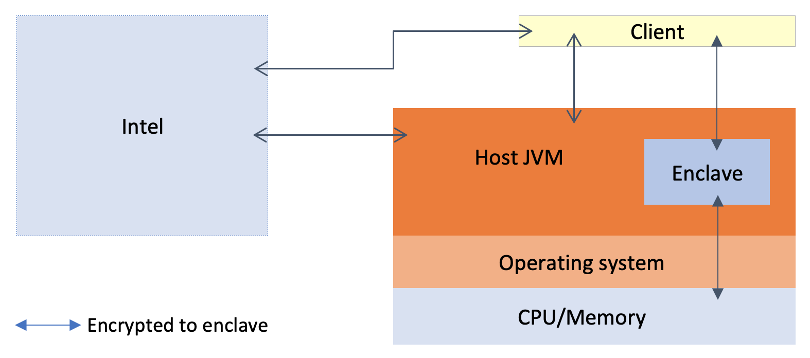

# Architecture overview

This page covers the basic architecture of Conclave, a [Confidential Computing](enclaves.md) platform.

## Primary entities

There are three main entities in any Conclave application.

1. Enclaves
2. Hosts
3. Clients

**Enclaves** are protected regions of memory in which you can write the confidential part of an application. An 
enclave resides inside a host program. However, a host or its owner cannot view or modify the code running in an 
enclave.

**Hosts** are programs that load enclaves. Hosts are untrusted and assumed to be malicious at all times. Hosts use a 
standard JVM like HotSpot. The host JVM and the enclave run inside the same operating system process. Clients 
communicate with enclaves through host programs. In some applications, hosts also assist with the application logic. 

**Clients** are programs that send and receive encrypted messages through hosts to communicate with enclaves. In a 
typical Conclave application, clients provide the user interface. Conclave doesn't mandate any particular network 
protocol for communication between clients and hosts. However, the content of a message is defined using the
[Conclave Mail](#Conclave-Mail) API.

Conclave's purpose is to enable clients to securely share data with an enclave, which will faithfully execute a 
specified algorithm without revealing anything to the potentially malicious host on which it runs.

Along with these three high-level entities, real Conclave deployments might have other participants:

1. Intel.
2. Optionally, a cloud provider.
3. Optionally, an auditor.

**Intel.** Intel provides the CPU hardware and runs specific servers to provide the host with certificates 
guaranteeing the authenticity of the chip. Intel provides this guarantee on initial setup and whenever the client
requests the authenticity of the [remote attestation](#remote-attestation).

For instance, if the host's SGX software stack is out-of-date and has known vulnerabilities or if the BIOS 
configuration is not correct, Intel's servers will report it to the client after verifying the host's remote 
attestation.

**Cloud provider.** A cloud provider needs to support SGX for Conclave to be usable. They may operate their
provisioning servers that take over from Intel's servers. You can find the instructions to use Conclave on Microsoft 
Azure
[here](machine-setup.md).

**Auditor.** In a pure enclave-oriented model, the user is responsible for understanding what the enclave does before
using it by reading the enclave's source code. In practice, the user may wish to outsource this auditing to someone 
else.

In the above diagram, the orange-shaded boxes are untrusted and could attack the enclave. In Conclave's threat model,
the host, the operating system, the BIOS, the drivers, and other peripherals are untrusted.

In contrast, the blue-shaded boxes are part of the _Trusted Computing Base_ (TCB), which is the set of components that 
must be non-malicious for the system to work. In this threat model, the TCB includes the enclave, the CPU, and Intel.

The operating system schedules the enclave onto the CPU and provides resources but is otherwise locked out of the 
enclave's operation. The enclave runs in an embedded-style environment. It cannot load DLLs/.so files or make system 
calls. So, there's no way for the enclave to load files or interact with the operating system directly. Instead, the 
enclave must ask the host to load any files and cryptographically prevent a malicious host from modifying the data.

Conclave simplifies this process in which a client communicates with an enclave through an untrusted host.

!!!Note

    As the enclave's runtime environment is different from a standard HotSpot JVM, you need to avoid advanced features 
    like the Java Flight Recorder in your enclave code.

## Important concepts in Conclave

Consider these questions on the working of Conclave:

* How does a client know it's really talking to an enclave?
* How does a client decide whether to trust any given enclave?
* What is the flow of communication in a typical application?
* How does data get from a client to an enclave without the host being able to spy on it?
* What deployment modes are available on the journey from unit testing to production?
* Can Conclave be deployed to the cloud?

The following section answers the above questions.

### Remote attestation

Clients need to be sure that they are communicating with a real enclave. They cannot rely on the host to _assert_ 
that this is the case because the host could be malicious. Instead, Conclave uses a process called
*remote attestation*.

First, clients need to obtain an
[`EnclaveInstanceInfo`](api/-conclave%20-core/com.r3.conclave.common/-enclave-instance-info/index.html) object. You 
can download this object on-demand from the host, or it could be published somewhere. 

The `EnclaveInstanceInfo` object encapsulates a remote attestation. The remote attestation includes the following 
information:

* The hash of the code inside the enclave.
* The hash of the key of any party who has signed that code.
* The security status of the machine on which the enclave is running.
* A public key whose private counterpart is known only to the enclave.

The remote attestation encapsulated within the `EnclaveInstanceInfo` object is signed by Intel. So the client can have 
confidence about the enclave even though they obtain the `EnclaveInstanceInfo` from an untrusted host.

The client tests the
[`EnclaveInstanceInfo`](api/-conclave%20-core/com.r3.conclave.common/-enclave-instance-info/index.html) against a
set of [constraints](constraints.md). Constraints are represented by an
[`EnclaveConstraint`](api/-conclave%20-core/com.r3.conclave.common/-enclave-constraint/index.html) object, which can 
be read from/written to a domain-specific language suitable for embedding in config files, command line options, and 
so on.

A constraint may mandate a specific set of code hashes. For example, a constraint might whitelist an existing 
version of an enclave and disallow any upgrades until the constraint is adjusted. Or, it may specify a set of allowed 
signing keys, enabling enclave authors to release new versions whenever they want. In the second scenario, the enclave 
creator is trusted, but the host is not.

When the client approves the set of constraints, it creates encrypted messages using the key in the 
[`EnclaveInstanceInfo`](api/-conclave%20-core/com.r3.conclave.common/-enclave-instance-info/index.html) object. The 
client establishes communication with the enclave by sending and receiving encrypted messages through the host using
[Conclave Mail](mail.md)

### Deciding whether to trust an enclave

Conclave makes it easy to write clients that understand remote attestations. Conclave provides multiple options to set
constraints to decide which enclaves to trust. To ensure that the clients communicate only with trusted enclaves, users 
can choose any of the three below models.

In the first model, the application developer gives the application's source code to the customer. The 
customer reviews the code to check if it is non-malicious. After verification, the customer compiles the code using the 
Conclave SDK to determine the hash of the enclave that _should_ be running on the remote server. The customer can 
then use this hash as their enclave constraint. The client will connect to the enclave only if the remote attestation
has the same hash. Otherwise, the client will refuse to communicate with the enclave.

In the second model, the customers employ a trusted third-party _auditor_ to review the enclave code. Customers might
also ask auditors to compile the enclave for them. The auditors give the compiled enclave to the application developer
and the hash to the customer.

Customers can use a third approach in cases where the enclave code changes frequently. In this model, the auditor 
reviews the code associated with each new enclave update and signs the enclave if it is secure. The customer uses a 
signature constraint that tells the client to trust any enclave signed by that auditor.

### Protocol sequence diagram

A typical interaction in a Conclave application looks like the below illustration.

<!---

https://mermaid-js.github.io/mermaid-live-editor/#/edit/eyJjb2RlIjoic2VxdWVuY2VEaWFncmFtXG4gICAgXG4gICAgcGFydGljaXBhbnQgRW5jbGF2ZVxuICAgIHBhcnRpY2lwYW50IENsb3VkL0ludGVsXG4gICAgcGFydGljaXBhbnQgSG9zdFxuICAgIHBhcnRpY2lwYW50IENsaWVudFxuICAgIHBhcnRpY2lwYW50IEludGVsXG4gICAgXG4gICAgcmVjdCByZ2JhKDI1NSwgMCwgMjU1LCAwLjEpXG4gICAgICAgIE5vdGUgbGVmdCBvZiBIb3N0OiBPbiBpbml0aWFsIGRlcGxveVxuICAgICAgICBDbG91ZC9JbnRlbC0-Pkhvc3Q6IFByb3Zpc2lvbmluZyBjZXJ0c1xuICAgIGVuZFxuICAgIEhvc3QtPj5DbGllbnQ6IFNlbmQgcmVtb3RlIGF0dGVzdGF0aW9uXG4gICAgTm90ZSBvdmVyIENsaWVudDogVmVyaWZ5IG1lYXN1cmVtZW50XG4gICAgb3B0IE9jY2FzaW9uYWxseVxuICAgICAgICBDbGllbnQtLT4-SW50ZWw6IFJlcXVlc3QgYXNzZXNzbWVudFxuICAgICAgICBJbnRlbC0tPj5DbGllbnQ6IEhvc3Qgc3RpbGwgc2VjdXJlIVxuICAgIGVuZFxuICAgIENsaWVudC0-Pkhvc3Q6IEVuY3J5cHRlZCBtZXNzYWdlIG92ZXIgSVBcbiAgICBIb3N0LT4-RW5jbGF2ZTogRW5jcnlwdGVkIG1lc3NhZ2VcbiAgICBFbmNsYXZlLT4-SG9zdDogRW5jcnlwdGVkIHJlc3BvbnNlXG4gICAgSG9zdC0-PkNsaWVudDogRW5jcnlwdGVkIHJlc3BvbnNlIG92ZXIgSVAiLCJtZXJtYWlkIjp7InRoZW1lIjoiZGVmYXVsdCJ9LCJ1cGRhdGVFZGl0b3IiOmZhbHNlfQ

sequenceDiagram

    participant Enclave
    participant Cloud/Intel
    participant Host
    participant Client
    participant Intel

    rect rgba(255, 0, 255, 0.1)
        Note left of Host: On initial deploy
        Cloud/Intel->>Host: Provisioning certs
    end
 HotSpot->>Client: Send remote attestation
    Note over Client: Verify measurement
    opt Occasionally
        Client->>Intel: Request assessment
        Intel->>Client: Host still secure!
    end
    Client->>Host: Encrypted message over IP
 HotSpot->>Enclave: Encrypted message
    Enclave->>Host: Encrypted response
 HotSpot->>Client: Encrypted response over IP
    
-->

1. When you use SGX in a machine for the first time, the host interacts with the cloud provider or Intel to retrieve
   certificates to prove authenticity.
2. The host then sends a remote attestation ([`EnclaveInstanceInfo`](api/-conclave%20-core/com.r3.conclave.common/-enclave-instance-info/index.html))
   to the client.
3. The client verifies the remote attestation and optionally asks Intel if the hardware setup of the machine is still
   secure or if there are known vulnerabilities (see [renewability](renewability.md)). This step can be repeated as 
   often as the client wants.
4. The client communicates to the enclave through the host by using encrypted messages and responses.

### Conclave Mail

Clients must securely communicate with enclaves without the host spying on the messages. Conclave uses
[Conclave Mail](mail.md) to send and receive encrypted messages between a client and an enclave. Conclave Mail makes 
communication between enclaves and clients easier, more secure, and more efficient when compared to classical 
architectures like HTTPS. 

### Testing and debugging

Conclave provides full unit testing support for enclaves. You can compile enclaves in one of these four modes:

* **Release**: Fully encrypted and protected memory used for the production version of an application.
* **Debug**: It's the same as release mode, but it has special instructions that allow the enclave memory to be read 
  and modified. This mode provides no protection but is a faithful recreation of the production environment that 
  you can use for testing.
* **Simulation**: This mode doesn't use SGX hardware at all. Simulation mode is helpful during development when 
  SGX-capable hardware may not be available. You need a Linux environment or a Linux Docker container to run 
  enclaves in simulation mode.
* **Mock**: In mock mode, the enclave class runs in the same JVM as the host. So, interactions between the enclave
  and the host are regular function calls. You can step through using a debugger and enjoy a regular Java development
  experience. See [here](mockmode.md) for more information on using and configuring mock mode.

The modes must match between how the enclave was compiled and how it's loaded. Conclave automatically handles this for
you. You can read more about enclave modes [here](enclave-modes.md).

#### Adding logs to enclaves

To add logs to an enclave, you have a couple of options.

1. You can use the [in-memory filesystem](persistence.md) to retain your logs in memory and then export them 
   occasionally to a trusted client or another enclave.

2. You can use the [persisted filesystem](persistence.md) to persist your logs. When you want to analyze the logs, you
   need to send the logs from the enclave to a trusted client.

Alternatively, in sensitive applications, you can decide that nobody should receive the logs when in release mode. 

Inside the enclave, `System.out` and `System.err` are wired to the host console, but there's no access to the
filesystem. In release mode, Conclave suppresses any output to `stdout` and `stderr` inside the enclave. So you can
add logs to `stdout` and `stderr` without worrying that it may leak production information outside the enclave.

### Deployment

You can get SGX-capable virtual machines from cloud providers. Currently, Microsoft Azure provides the easiest, 
up-to-date source of SGX VMs.

A Conclave host application includes the enclave bundled into the same JAR and the native libraries required for 
working with the kernel driver and Intel infrastructure. So, you can deploy a Conclave application by using regular
Java deployment procedures. For example, use Gradle's `assemble` plugin to create a tarball/zip of your application or
create and copy a fat JAR to the server.

