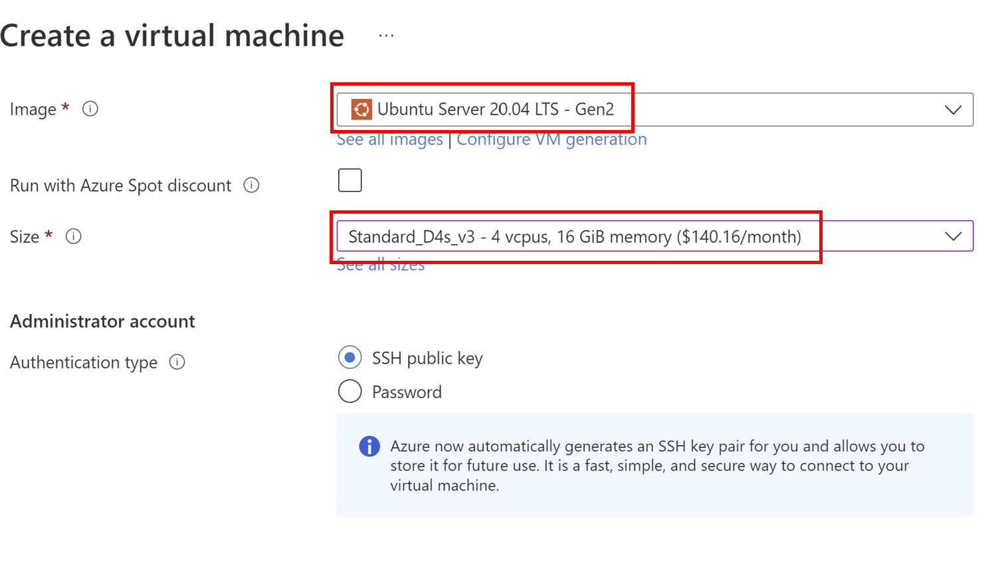

# Deploying to Azure

!!! important
    Azure does not guarantee access to the same machine on reboot. On reboot, you might lose encrypted secrets for a particular enclave.
    To prevent loss of data, consider using the [Key Derivation Service](kds-detail.html) (KDS).

## Attestation

Microsoft Azure provides ready-made VMs that support the latest attestation protocols. Follow the instructions below to set up such a VM.

## Machine setup

You need to create an Ubuntu 20.04 LTS Gen2 VM from the [confidential
compute](https://azure.microsoft.com/en-gb/solutions/confidential-compute/) line (named like this: DC?s_v3) where the
question mark is the size. Other distributions should work as long as they are on these VMs, but we haven't tested them.

=== "Azure CLI"

    The VM must be created inside a resource group. You may use an existing resource group or create one with the
    following command:
    ```
    az group create -l <LOCATION> -n <GROUP-NAME>
    ```

    Now create the VM.
    ```bash
    az vm create \
    --size Standard_DC4s_v3 \
    --image Canonical:0001-com-ubuntu-server-focal:20_04-lts-gen2:latest \
    --name <VM-NAME> \
    --resource-group <GROUP-NAME>
    ```

    `VM-NAME` is the name you choose for the VM and `GROUP-NAME` is the name of your resource group.

=== "Azure Portal"

    Make sure you do the following when creating your Azure Confidential Computing VM:

    * Use the `Ubuntu Server 20.04 (Gen2)` image
    * Pick a size that's got plenty of RAM. For example, you might want to click "Change size" to find `DC4s_v3` type
    * Ensure that the public inbound ports are open for SSH access

    
    

After you have logged on to the VM:

1. Check that the `enclave` device is present in the `/dev/sgx/` or `/dev/sgx_*` directory
2. Check driver version `dmesg | grep sgx`. Conclave requires driver version 1.33+
3. If either check fails:
    * Download the [driver](https://download.01.org/intel-sgx/latest/dcap-latest/linux/distro/ubuntu20.04-server/)
    * Follow the [install instructions](https://download.01.org/intel-sgx/sgx-dcap/1.8/linux/docs/Intel_SGX_DCAP_Linux_SW_Installation_Guide.pdf)
4. Add your user into `sgx_prv` group to give it access to SGX.

```sh
sudo usermod -aG sgx_prv $USER
```
5. Log out from the VM and log in again.

You have set up an Azure VM with the latest attestation protocols.

You can skip the rest of this document if you are only looking for a quick set up.

## Background: The DCAP protocol

There are two protocols for establishing what code runs in an enclave: EPID and DCAP. EPID is an older
protocol designed for consumer applications and includes some sophisticated privacy features. For servers
where the IP address doesn't need to be hidden (because it's public in DNS, to begin with), these features
aren't helpful, and thus there is DCAP (_Data Center Attestation Primitives_). DCAP requires more modern hardware
but is otherwise simpler and more robust. You may also see DCAP referred to as "ECDSA attestation".

!!! important
    Intel does not provide EPID attestation support on any Xeon Scalable processors including the Ice Lake Xeon CPUs and any future
    generations. Please ensure you are using DCAP attestation on these platforms.


In DCAP, repeated attestation requests aren't forwarded to Intel, but rather served from a cache. A newly installed
machine obtains a machine certificate from Intel via the cache, which may then be persisted to disk. All this is
automated for you.

As cloud providers run caches, DCAP supports vendor-specific plugins. Intel provides a default one
which requires a [subscription](https://api.portal.trustedservices.intel.com/provisioning-certification).  

Azure provides a DCAP [plugin](https://github.com/microsoft/Azure-DCAP-Client) that does not require a subscription. Conclave
bundles and uses Azure's DCAP plugin by default. The Azure caches are open to the public internet and can be used from anywhere. Azure Confidential Computing instances like DC4s_v3 come pre-provisioned for DCAP and as Conclave
comes with the necessary libraries bundled, you don't need to do any further setup.

### DCAP Plugin
To perform attestation using DCAP, Conclave needs a way to gather information about the platform the enclave is hosted on. This information provides proof from Intel that the system supports SGX and that it is patched and up to date.

DCAP is designed to work on many different server topologies. So, rather than directly connecting to Intel services to retrieve this information, the cloud vendor or the owner of the SGX system must provide a DCAP client plugin with the required information. Intel provides a generic DCAP client plugin as part of the DCAP runtime. To use this, you also need to set up a Provisioning Certificate Caching Service (PCCS). Intel provides an example and some instructions [here](https://github.com/intel/SGXDataCenterAttestationPrimitives/blob/master/QuoteGeneration/pccs/README.md). If you would like to use Intel's reference implementation of their [PCCS service](https://github.com/intel/SGXDataCenterAttestationPrimitives/blob/master/QuoteGeneration/pccs), then additional work may be required to provide data in the correct format for Conclave. Please contact R3 support if you need to set this up.

Microsoft has written a DCAP client plugin that works with its Azure Confidential Compute virtual machines. In fact, it also works outside of Azure for single CPU systems, but this may not always be the case.

Conclave's bundled Azure client plugin will *only* be used if no other plugin has been found on the system.
The runtime will use the first `.so` it encounters in the search order below:
```
/usr/lib/x86_64-linux-gnu/libdcap_quoteprov.so.1
/usr/lib/x86_64-linux-gnu/libdcap_quoteprov.so
/usr/lib/libdcap_quoteprov.so.1
/usr/lib/libdcap_quoteprov.so
```
Should you decide to use a bundled version (recommended), ensure the files listed above don't exist (delete or rename
them if necessary).

!!! important
    The bundled DCAP Azure client plugin works with all current generation Azure confidential VMs, as well as existing
    CPUs. However, if Azure extends their offerings to include new platforms, or if you use a new generation
    system, then the bundled Azure client plugin may throw an error
    when attempting to load your enclave. In this case, [follow the instructions below](#azure-client-plugin) to
    build/install an updated version of the Azure client plugin that supports the platform.

You may want to set the Azure DCAP client logging level to FATAL as the default setting is quite verbose:
```sh
export AZDCAP_DEBUG_LOG_LEVEL=FATAL
```

If you are using the bundled version, you can skip the rest of this section. Otherwise, read on for instructions on how to manually configure the DCAP plugin.

#### Azure client plugin

* Identify the currently installed DCAP client plugin. It will always have one of the following names: `libdcap_quoteprov.so.1` or `libdcap_quoteprov.so`. You might find other similarly named files, but they won't be used as a plugin.
```sh
ls /usr/lib/x86_64-linux-gnu/libdcap_quoteprov.so*
ls /usr/lib/libdcap_quoteprov.so*
```

* If you already have the Azure plugin installed then it will contain the text 'AZDCAP'.
```sh
grep AZDCAP /usr/lib/x86_64-linux-gnu/libdcap_quoteprov.so*
grep AZDCAP /usr/lib/libdcap_quoteprov.so*
```
* If the Azure plugin is not currently installed then:
    * You can build it from [source](github.com/microsoft/Azure-DCAP-Client).
    * Or extract from a pre-built package provided by Microsoft. E.g. for Ubuntu 20.04 via the command below (only libdcap_quoteprov.so is required).
```sh
wget https://packages.microsoft.com/ubuntu/20.04/prod/pool/main/a/az-dcap-client/az-dcap-client_1.8_amd64.deb && ar x az-dcap-client_1.8_amd64.deb data.tar.xz && tar xvJf data.tar.xz --transform='s/.*\///' ./usr/lib/libdcap_quoteprov.so && rm az-dcap-client_1.8_amd64.deb data.tar.xz
```
* The preferred name and location of the DCAP client plugin is `/usr/lib/x86_64-linux-gnu/libdcap_quoteprov.so.1`.
```sh
cp $(Azure-DCAP-Client)/libdcap_quoteprov.so /usr/lib/x86_64-linux-gnu/libdcap_quoteprov.so.azure
ln -sf /usr/lib/x86_64-linux-gnu/libdcap_quoteprov.so.azure /usr/lib/x86_64-linux-gnu/libdcap_quoteprov.so.1
```
* Set the Azure DCAP client logging level to FATAL as desired.
```sh
export AZDCAP_DEBUG_LOG_LEVEL=FATAL
```
#### Intel DCAP plugin
Please read the installation instructions in the "Install the DCAP packages" section of the [installation guide](https://download.01.org/intel-sgx/sgx-dcap/1.8/linux/docs/Intel_SGX_DCAP_Linux_SW_Installation_Guide.pdf).

!!! note
    If you have the Intel DCAP plugin installed alongside the Azure one, remember that running `apt update` might reset the symlink above to point to Intel's plugin.

## Using Docker container(s)
If you plan to use a Docker container with DCAP hardware, you must map two different device files like this:

```sh
docker run --device /dev/sgx/enclave --device /dev/sgx/provision ...
```

!!! note
    Azure offers a "Confidential Kubernetes" service. At this time, we haven't tested Conclave with that. If you try it,
    let us and the community know if it works (conclave-discuss@groups.io)

## Running a Conclave Application
After setting up the machine, you can follow the [Compiling and running](running-hello-world.md) tutorial to run the `hello-world` sample.

The sample is configured to use DCAP attestation with the
following line in `Host.java`
```java
enclave.start(new AttestationParameters.DCAP(), ... );
```

DCAP doesn't require specific API keys or parameters, so just creating the empty object is sufficient to choose it.
