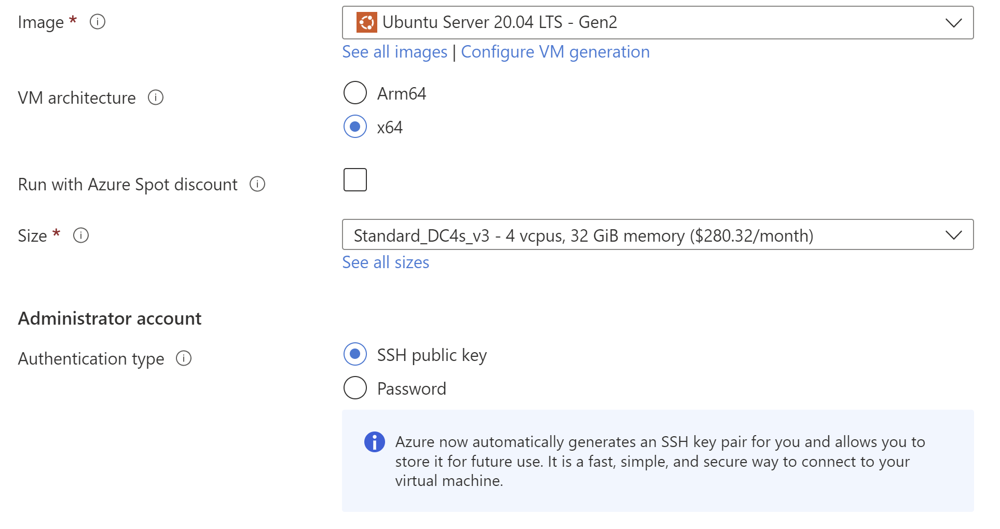

# Deploying to Azure

!!!Important

     Azure does not guarantee access to the same machine on reboot. On reboot, you might lose encrypted secrets for 
     a particular enclave. To prevent loss of data, consider using the [Key Derivation Service](kds-detail.html)(KDS).

## Attestation

Microsoft Azure provides ready-made VMs that support the latest attestation protocols. Follow the instructions below to set up such a VM.

## Machine setup

You need to create an Ubuntu 20.04 LTS Gen2 VM from the [confidential
compute](https://azure.microsoft.com/en-gb/solutions/confidential-compute/) line (named like this: DC?s_v3) where the
question mark is the size. Other distributions should work as long as they are on these VMs, but we haven't tested them.

=== "Azure CLI"

    The VM must be created inside a resource group. You may use an existing resource group or create one with the
    following command:
    ```
    az group create -l <LOCATION> -n <GROUP-NAME>
    ```

    Now create the VM.
    ```bash
    az vm create \
    --size Standard_DC4s_v3 \
    --image Canonical:0001-com-ubuntu-server-focal:20_04-lts-gen2:latest \
    --name <VM-NAME> \
    --resource-group <GROUP-NAME>
    ```

    `VM-NAME` is the name you choose for the VM and `GROUP-NAME` is the name of your resource group.

=== "Azure Portal"

    Make sure you do the following when creating your Azure Confidential Computing VM:

    * Use the `Ubuntu Server 20.04 (Gen2)` image
    * Pick a size that's got plenty of RAM. For example, you might want to click "Change size" to find `DC4s_v3` type
    * Ensure that the public inbound ports are open for SSH access

    
    

After you have logged on to the VM:

1. Check that the `enclave` device is present in the `/dev/sgx/` or `/dev/sgx_*` directory.
2. Add your user into `sgx_prv` group to give it access to SGX.
```sh
sudo usermod -aG sgx_prv $USER
```
3. Log out from the VM and log in again.

You have set up an Azure VM with the latest attestation protocols.

You need to use the DCAP protocol for attestation. For this, you need to use the
[`AttestationParameters.DCAP`](https://docs.conclave.net/api/-conclave%20-core/com.r3.conclave.host/-attestation-parameters/-d-c-a-p/-attestation-parameters.-d-c-a-p.html) class when starting the
enclave via
[`EnclaveHost.start`](https://docs.conclave.net/api/-conclave%20-core/com.r3.conclave.host/-enclave-host/start.html).