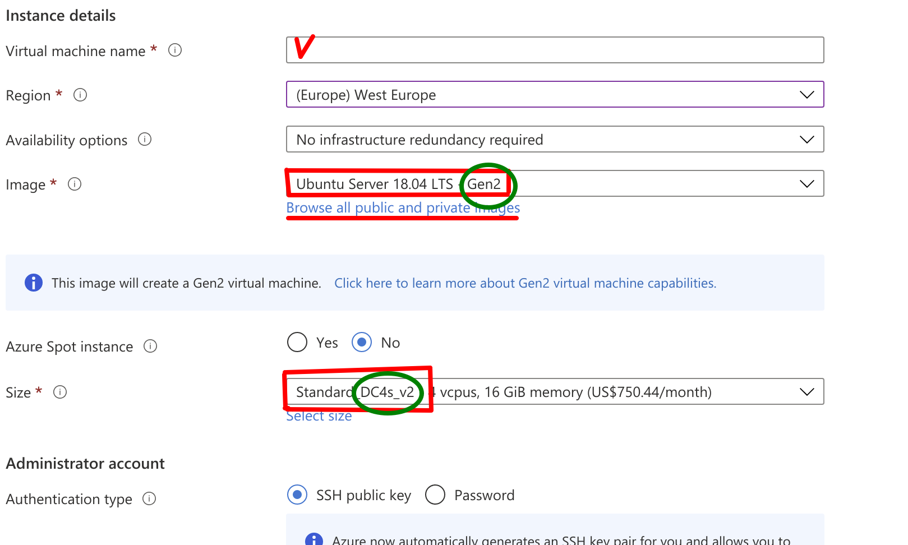
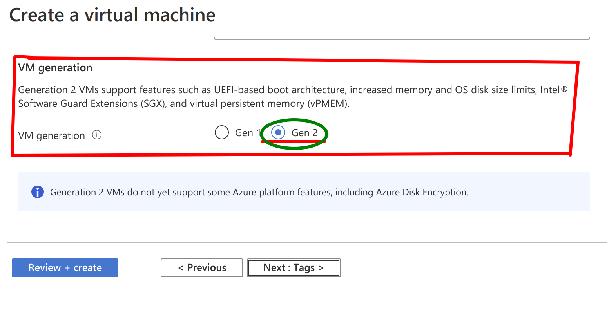

# Remote Attestation

Got your enclave built and running ? Good, but how do you know it can be trusted ?  
Well, here is where the *attestation* comes to play - Intel provides a *remote* service for that.  
The common process is:
* get a *report* from your enclave
* get the quoting enclave to sign it - the result is called a *quote*
* the actual validation of the quote depends on the API used

## EPID or ECDSA
For remote attestation Intel provides two APIs - EPID and ECDSA.
ECDSA attestation is implemented via Data Center Attestation Primitives (DCAP),
hence commonly referenced as "DCAP".

#### [EPID](https://api.portal.trustedservices.intel.com/EPID-attestation)
Older of two. Web-based, does not need any extra bits to be installed.  
Requires SPID and AttestationKey (via subscription), *and* Internet access.  
Somewhat slow, only really suitable for stand-alone / long-running applications.  
The validation of the EPID quote requires sending it over to Intel's webservice and validating the signature returned.

#### [ECDSA/DCAP](https://api.portal.trustedservices.intel.com/provisioning-certification)
Data Center(s) oriented service.    
Repeating attestation requests aren't forwarded to Intel, but rather served from a cache.  
Supports vendor-specific plugins. Intel provides a default one (requires a [subscription](https://api.portal.trustedservices.intel.com/products/liv-intel-software-guard-extensions-provisioning-certification-service)).  
Azure also provides own [plugin](https://github.com/microsoft/Azure-DCAP-Client) that does not require a subscription.  
The validation of ECDSA quote involves the verification of the quoting enclave and the signature of your enclave.
 
## Conclave
R3 Conclave supports both EPID and DCAP.  
The Azure Confidential Computing instances (DC4s_v2) come pre-provisioned for DCAP.  
Default provider by Intel requires good bit of setup and provisioning to be done.  
At a moment (Beta4) DCAP had only been tested with Azure plugin. 

#### Boring stuff (setup)
We are aiming for a zero setup, but for now a bit of setup is still required.  
This section describes the setup for Azure Confidential Computing (*CC*) instance using Azure plugin.  

IMPORTANT: You need to create Ubuntu 18.04 LTS Gen2 VM

You might have to click "Browse all public and private images" to find `Gen2` image type.  
Same for the *Size*, you might have to click "Select size" to find `DC4s_v2` type.  
 



Azure CC instances come with DCAP driver installed, but nothing else.  
Just in case:
* check if `/dev/sgx/enclave` device is present
* check driver version `dmesg | grep sgx`
* required driver version 1.33+
* if either check fails:
  * download the [driver](https://01.org/intel-softwareguard-extensions/downloads/intel-sgx-dcap-1.8-release)
  * follow install [instructions](https://download.01.org/intel-sgx/sgx-dcap/1.8/linux/docs/Intel_SGX_DCAP_Linux_SW_Installation_Guide.pdf)

#### Using Docker container(s)
With DCAP driver, the name of SGX device has changed.
If you plan to use a Docker container with DCAP hardware, you must map two different device files like this:
```
docker run --device /dev/sgx/enclave --device /dev/sgx/provision ...
```

###### SGX PSW & DCAP
Run the following as `root`:
```
echo "deb [arch=amd64] https://download.01.org/intel-sgx/sgx_repo/ubuntu bionic main" >> /etc/apt/sources.list.d/intel-sgx.list
wget -qO - https://download.01.org/intel-sgx/sgx_repo/ubuntu/intel-sgx-deb.key | apt-key add -
apt update

apt install -y -q libsgx-quote-ex libsgx-urts
apt install -y -q libsgx-dcap-ql libsgx-dcap-ql-dev
```

The user has to be included into `sgx_prv` group:
```
usermod -aG sgx_prv user
```

Or run the following for your current user (not as `root`):
```
sudo usermod -aG sgx_prv $USER
```

###### Azure plugin
You must build one from [source](https://github.com/microsoft/Azure-DCAP-Client).  
You might have to install some extra packages to build the plugin; follow [Readme](https://github.com/microsoft/Azure-DCAP-Client/blob/master/src/Linux/README.MD) provided.  

Then as `root`, *install* the plugin:
```
cp $(Azure-DCAP-Client)/libdcap_quoteprov.so /usr/lib/x86_64-linux-gnu/libdcap_quoteprov.so.azure
ln -sf /usr/lib/x86_64-linux-gnu/libdcap_quoteprov.so.azure /usr/lib/x86_64-linux-gnu/libdcap_quoteprov.so.1
```

#### hello-world

You have to choose attestation method at compile time (see Host.java).  
```java
        enclave.start(new AttestationParameters.DCAP(), ... );
```
```java
        enclave.start(new AttestationParameters.EPID(spid, attestationKey), ... );
```
