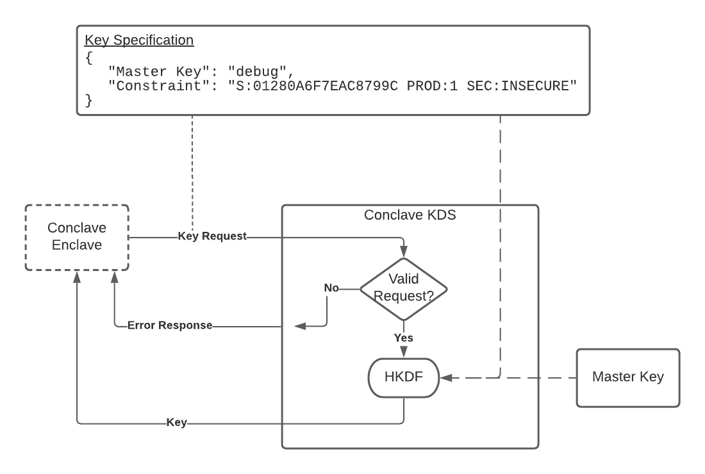
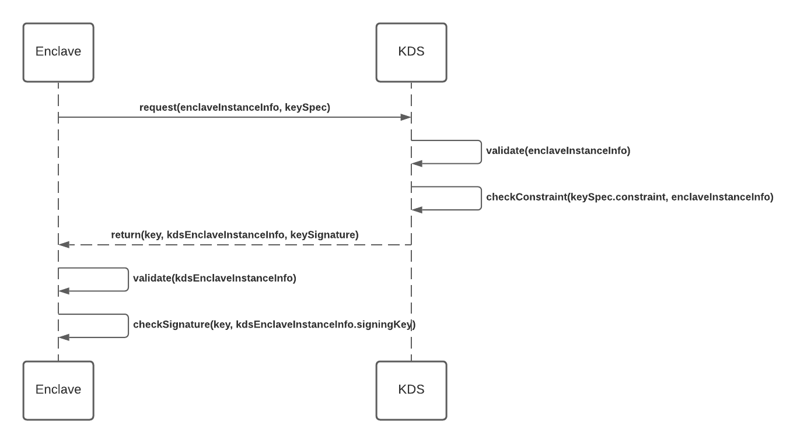

# A Detailed Look at Persisting Data with the Key Derivation Service
Enclaves provide protection for data whilst it is stored in the hardware
encrypted memory provided by Intel SGX. This means that all the time sensitive
data is being processed by an enclave, the privacy and integrity of the data is
maintained. Thus the enclave provides 'data in-use' protection.

But how do we get the data inside the enclave in the first place?

The first option is to transfer the data from a trusted source, such as a data
owner. The data owner encrypts their data using a public key where the private
part of the key is only known inside the safety of the enclave. The data owner
can then send the data to the enclave using any transport mechanism, safe in the
knowledge that only the enclave can decrypt and access the data. This is the
mechanism provided by [Conclave Mail](mail.md) which provides 'data
in-transit' protection.

But what if we want to store or access data from an untrusted source? For
example, we want to use the disk of the server that is hosting the enclave to
store some data, either for long-term recall of the data, to allow access to a
larger dataset than can fit into memory or to allow an enclave to restore the
current state after it is restarted. In this case we need to provide a solution
that encrypts the data before it leaves the enclave allowing it to be safely
stored on the disk, providing 'data at-rest' protection.

Conclave provides two different data persistence mechanisms to the developer
which provide support for common Confidential Computing use cases. Both will be
discussed in this document. But first we need to understand a bit about how
encryption keys are obtained and used in Conclave.

# CPU keys for 'sealing' data
In order for an enclave to be able to encrypt data that is to be persisted on an
untrusted data store, the enclave needs to have access to an encryption key with
at least the following properties:

* The key must be unique to a particular enclave configuration, configurable by
  the developer to be bound to any combination of the enclave code and version,
  the signer of the enclave or other attributes of the enclave or platform it is
  running on.
* The key must be only available inside enclaves that match the required
  configuration.
* It must be possible to deterministically regenerate the key, even if the
  enclave or the server is restarted.
  
Conclave uses Intel SGX to provide the hardware enclave capabilities. SGX
provides a root 'sealing key', which is a key that is fused into the CPU silicon
at the time the CPU was manufactured and it is only known to the CPU itself. This
key can be used to derive other keys based on the configuration of the enclave. 
Therefore it fulfils all of the requirements set out above, and Conclave can be
configured to use a key derived from the sealing key for persisting data.

However, this is a problem with using the sealing key for persisting data. The
sealing key that is fused into the CPU silicon is _unique to that particular
CPU_. This means that data persisted by an enclave running on one CPU cannot be
decrypted by another CPU, _even if it is running exactly the same version of the
enclave_.

This might not be a problem if you own your own SGX servers. If you can
guarantee that the enclave is always running on the same hardware then
persistence will work without issue. But what happens if that server hardware
fails? In this case the persistent data would be lost forever.

What happens if you want to use a Cloud Service Provider such as Microsoft Azure
to host your enclave? CSPs do not provide any guarantee that a service will not
be transferred from one physical platform to another. This means that your
persistent data is always fragile and could effectively be cryptographically
erased at any point.

So how do we solve this with Conclave?

# Key Derivation Service - Providing stable keys to enclaves
Let's take a look at the encryption key requirements again:

* The key must be unique to a particular enclave configuration, configurable by
  the developer to be bound to either the enclave code and version, the signer
  of the enclave and other fields.
* The key must be only available inside enclaves that match the required
  configuration.
* It must be possible to deterministically regenerate the key, even if the
  enclave or the server is restarted.

There is no requirement that says the key must be unique to a particular CPU. So
if we can provide a service that can securely transfer keys to Conclave enclaves
that meet the specifications set out above then we have a solution. 

R3 provides the Conclave Key Derivation Service (KDS) that can be used by any
Conclave enclave to obtain stable keys that can be used for persisting data
regardless of what physical system the enclave is running on. This solves the
problems described above where data is bound to a particular CPU - when using
the KDS, data encrypted by one physical system can be decrypted by a different
physical system, so long as the Conclave enclave meets the requirements to
access the key for a particular configuration.

When configuring your enclave for persistence you can specify whether to use the
Conclave KDS to obtain a key instead of using the sealing key.

# How does it work?
The KDS has access to a [master key](#what-is-the-master-key) which is used as a
seed for all keys that are requested from the KDS. In order to protect the
master key and the key derivation process, the KDS is itself implemented inside
a Conclave enclave. This means that application enclaves can verify the
integrity of the KDS using remote attestation via the KDS [`EnclaveInstanceInfo`](api/-conclave/com.r3.conclave.common/-enclave-instance-info/index.html).
And vice versa, the KDS can verify the integrity of application enclave
instances using their `EnclaveInstanceInfo`.

When an enclave requests a key from the KDS, the KDS generates the key for the
enclave by deriving it from the master key using an HMAC Key Derivation Function
(HKDF) passing a set of parameters in order to generate a key that is unique for
each distinct set of parameters. The set of parameters is called the 'key
specification'.

A key specification consists of the following fields:

| Field | Description |
| ----- | ----------- |
| Master Key Type | The type of [master key](#what-is-the-master-key) to derive the key from. |
| Key Policy Constraint | The conditions under which the KDS will allow an enclave to access the requested key. |

The developer provides a key specification within the code of the enclave that
will be used to request a key from the KDS when the enclave is started. This
specification tells the KDS which master key to use, and whether any other
enclaves should be able to access this key, and, if so, which.

But if an enclave can request a key that other enclaves have access to, what
stops a bad actor building an enclave that asks for a key to which an unrelated
enclave also has access to and hence access that enclave's secrets? The KDS
needs to provide some sort of access control over which enclaves are allowed to
access which keys. This is achieved by including a "Key Policy Constraint"
within the key specification. The constraint itself is used within the key
derivation process which means that if the bad actor does request a
key to which a victim enclave would have access, it isn't actually a key that
the victim enclave is actually using, since that enclave would be using a
different constraint, one which doesn't include the malicious enclave, and hence
will have received a different key.

The key policy constraint allows the enclave author to tell the KDS under
exactly what conditions this enclave or any other enclave is allowed to be given
access to the key defined by the specification. In effect it allows the enclave
to say to the KDS: _"Please let me have this key only if I have been signed with
a particular key and am running on a secure platform"_. Or alternatively,
_"Please only ever let this exact version of this enclave have access to this
key"_.

The key specification is defined when the enclave is built. This means that the
key specification forms part of the hash measurement of the enclave. Thus it
cannot be tampered with after the enclave has been built. Any tampering would be
detected as the measurement would change which would be apparent via a remote
attestation of the enclave.

The practical effect of this design is that enclaves themselves have sovereignty
over which other enclaves could have access to their keys, and there is no need
for a central administrator with the power to make this decision and who would
otherwise have the ability to obtain any key at all. This means that the
solution can be made entirely decentralised simply by enabling the master key to
itself be held in a decentralised fashion, which is work planned for a future
release.

# Deriving keys from the key specification
The KDS generates the key for the enclave by deriving it from the master key
using an HMAC Key Derivation Function (HKDF) passing the key specification as
parameters to the function.

In the diagram above, an enclave built using Conclave wants to use a key from
the KDS for persistence so the Conclave SDK makes a request to the KDS based on
the configuration provided inside the enclave code. The request to the KDS
includes the key specification, consisting of the "Master Key" to use and the
key policy constraint that must be met in order for the KDS to release a key to
the requesting enclave.

The KDS then checks to see if the request from the enclave is valid: is the
enclave authorised to have access to the key it is requesting? If the enclave is
not authorised then an error response is returned to the enclave.

If the enclave is authorised to have access to the requested key then the KDS
will derive the key in preparation for returning it to the enclave. The
derivation process uses a standard HMAC Key Derivation Function (HKDF) which
takes the master key material and derives it using each of the parameters in the
key specification to create a key unique to that specification. The resulting
key is then sent securely back to the Conclave enclave.

# Validation of Key Requests
The KDS will only send a key to an enclave if the enclave passes validation
checks that prove it is entitled access to the key. How is that validation
achieved?

A Conclave enclaves use remote attestation to prove to a third-party, in this case
the KDS, the version and integrity of the code running inside the enclave, the
signing key used to sign the enclave and the fact that it is running securely on a real
SGX platform. The KDS can verify the [`EnclaveInstanceInfo`](api/-conclave/com.r3.conclave.common/-enclave-instance-info/index.html) report from the
enclave requesting the key and can use the information within this report to
determine whether the enclave meets the constraints defined in the key
specification to determine whether the enclave should be allowed access to the
key or not.

When a developer configures their enclave, they specify a key policy constraint for the
key that will be requested from the KDS for use by the enclave. This constraint
is very similar to the [`EnclaveConstraint`](api/-conclave/com.r3.conclave.common/-enclave-constraint/index.html) that a client application uses to
determine whether to trust an enclave or not. The enclave passes its
[`EnclaveInstanceInfo`](api/-conclave/com.r3.conclave.common/-enclave-instance-info/index.html) to the KDS along with the key specification for the key it
is requesting. The KDS then validates the `EnclaveInstanceInfo` and then builds
an `EnclaveConstraint` object using the key policy constraint in the key
specification and checks the `EnclaveInstanceInfo` against that constraint. If
the constraint check passes then the enclave is allowed access to the key.

# Secure transfer of the key
The key is securely transferred to the enclave by encrypting the key using the
enclave's public key which is defined as part of the attested enclave's
[`EnclaveInstanceInfo`](api/-conclave/com.r3.conclave.common/-enclave-instance-info/index.html). This guarantees that only the recipient enclave can
decrypt the key received from the KDS.

But how does the enclave know that the key was generated by a valid instance of
the KDS? If the KDS has been compromised then the enclave may be given keys that
are not secure.

To solve this, the KDS itself is running inside a Conclave enclave. This means
that it benefits from the same protections and assurances as any other enclave.
The KDS can prove exactly what code is running inside the enclave, the signing
key used to sign the enclave and the fact that it is running on a secure Intel
SGX platform using remote attestation. The application enclave uses remote
attestation via its [`EnclaveInstanceInfo`](api/-conclave/com.r3.conclave.common/-enclave-instance-info/index.html) to prove its status to the KDS, and
vice versa, the KDS uses remote attestation via its own `EnclaveInstanceInfo` to
prove it is a valid, uncompromised KDS instance that is providing the keys to
the application enclave.

All of this happens behind the scenes to developers using the Conclave SDK: the
Conclave SDK automatically performs all required mechanisms required to ensure a
secure key exchange.

# What is the 'Master Key'?
In order for the KDS to provide stable keys to enclaves developed with the
Conclave SDK, the KDS itself needs access to a stable master key. Rather than
providing one fixed master key, the KDS can be given access to different sources
of master key, the actual master key to use being provided as part of the key
specification.

The master key type can be selected from the table below:

| Master key type | Description |
| ----- | ---------------|
| `MasterKeyType.DEVELOPMENT` | A master key that can be used for developing enclaves in mock, simulation or debug mode. This master key must not be used to derive enclave keys in production enclaves. |
| `MasterKeyType.CLUSTER` | A master key that can be used for enclaves running in release mode. This master key can be used to derive enclave keys in production enclaves. The master key exists across a cluster of KDS nodes to increase availability and reduce the chance of it being lost. |
| `MasterKeyType.AZURE_HSM` | A master key backed by a FIPS compliant azure HSM. This master key can be used to derive enclave keys in production enclaves, and is suitable for applications where strong availability requirements or regulatory compliance requirements are necessary. |

!!!Important
    Initially the KDS will be provided as a public preview to Conclave customers
    and, as such, only a single master key type is supported which __must not be
    used for production enclaves__ as it is derived from an insecure source. To
    ensure that keys derived from this master key source are not used in production
    enclaves, the KDS will refuse to issue keys to enclaves that have been built in
    Release mode.

# Migrating data from a previous version of an enclave
Ideally, keys will be tied to an exact version of an enclave. This provides the
smallest opportunity for any vulnerability to be exploited - if a vulnerability
is discovered in a particular version of the platform or enclave, the data is
re-encrypted using a new key in the patched version to prevent an exploit from
accessing the encrypted data.

However, tying keys to an exact version of an enclave creates challenges in the
data migration to the new version. How does the KDS know that the new version
should have access to a particular key?

The reality is that in order to migrate data to a new version you need to relax
the constraints to allow the migration to take place. The simplest way to do
this is to use the example above that allows any enclave for a particular
product signed using the same key to have access to the key. This means that all
new enclaves for the particular product can access data encrypted with previous
versions without any data migration being necessary.

A more secure solution would be to introduce a minimum revocation level in the
key specification constraint. A new version of the enclave would request a key
from the KDS specifying a minimum revocation level that matches the
configuration of the enclave. This means that this version of the enclave and
all enclaves that have a higher version will be allowed access to the key.

But remember, the key policy constraint is part of the key specification. Thus
changing it results in a different key being generated. This is actually the
behaviour we desire, as we want to encrypt data with a new key when the
minimum revocation level is increased, so older, potentially vulnerable enclaves
cannot access the new data. However, the new enclave will need to request the
previous key specification from the KDS to read the current persisted data and
migrate it to the new key by re-encrypting it.

The above migration process does not yet happen automatically using the Conclave
SDK, but is likely to be introduced in a future version. Please talk to us if
you would like more information about this.

