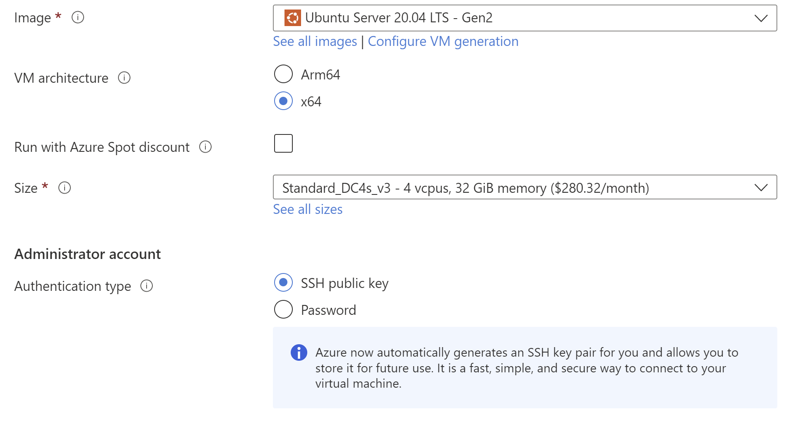
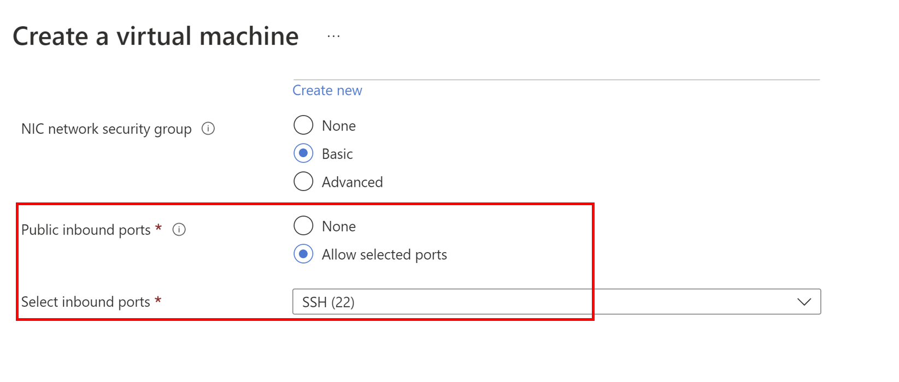

# Deploying to Azure
The most efficient way to deploy a Conclave application is to use an Azure virtual machine.

## Attestation

Microsoft Azure provides ready-made VMs that support the latest attestation protocols. Follow the instructions below
to set up such a VM.

## Machine setup

You need to create an Ubuntu 20.04 LTS Gen2 VM from the
[confidential compute](https://azure.microsoft.com/en-gb/solutions/confidential-compute/) line
(named like this: DC?s_v3) where the question mark is the size.

=== "Azure CLI"

    1. You need to create the VM inside a resource group. You may use an existing resource group or create one with the
    following command:
    ```bash
    az group create -l <LOCATION> -n <GROUP-NAME>
    ```

    2. Create the VM.
    ```bash
    az vm create \
    --size Standard_DC4s_v3 \
    --image Canonical:0001-com-ubuntu-server-focal:20_04-lts-gen2:latest \
    --name <VM-NAME> \
    --resource-group <GROUP-NAME>
    ```

    `VM-NAME` is the name you choose for the VM, and `GROUP-NAME` is the name of your resource group.

=== "Azure Portal"

    Make sure you do the following when creating your Azure Confidential Computing VM:

    * Use the `Ubuntu Server 20.04 (Gen2)` image
    * Pick a size that's got plenty of RAM. You might have to click "Change size" to find the `DC4s_v3` type
    * Ensure that the public inbound ports are open for SSH access

    
    

After you have logged on to the VM:

1. Check that the `enclave` device is in the `/dev/sgx/` or `/dev/sgx_*` directory.
2. Add your user into the `sgx_prv` group to give it access to SGX.
```bash
sudo usermod -aG sgx_prv $USER
```
3. Log out from the VM and log in again so that your user has SGX access.

You have set up your Azure VM successfully.

You need to use the DCAP protocol for attestation. For this, you need to use the
[`AttestationParameters.DCAP`](https://docs.conclave.net/api/-conclave%20-core/com.r3.conclave.host/-attestation-parameters/-d-c-a-p/-attestation-parameters.-d-c-a-p.html)
class when starting the enclave using
[`EnclaveHost.start`](https://docs.conclave.net/api/-conclave%20-core/com.r3.conclave.host/-enclave-host/start.html).

When using a Conclave application on Azure, you should remember that Azure does not guarantee access to the same 
machine on reboot. As encrypted secrets are strictly tightened to the Intel SGX CPU running the VM, you might lose data 
if Azure moves the VM to a different machine. To prevent data loss, you need to use the
[Key Derivation Service](kds-detail.md)(KDS).