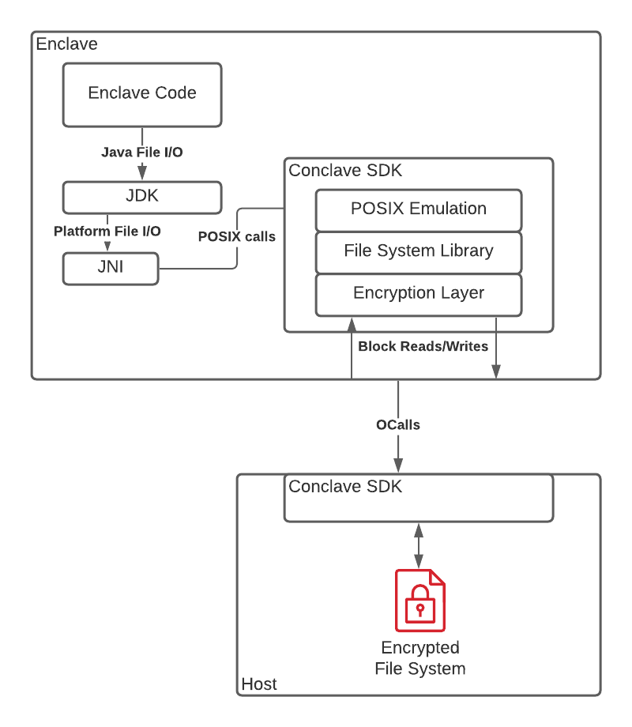

# Enclave persistence

The enclave does not have access to a physical disk for persisting data. Instead it must ask the host to store 
data on its behalf. This presents a problem as the host should not see the data and it may not faithfully store 
it correctly or it may even try to deduce information if it can observe access patterns when the enclave reads or 
writes to it.

To address these issues, Conclave provides two perisistence mechanisms: the the enclave filesystem and the 
[persistent map](api/-conclave/com.r3.conclave.enclave/-enclave/get-persistent-map.html). Both come with their 
pros and cons. Which one to use depends on the application logic and how much the users of the enclave trust the host.

## Conclave filesystems

Conclave enclaves can do file I/O operations, but these are not directly mapped to the host filesystem. Instead, all 
filesystem activity is mapped to an **in-memory** and/or to a **persisted** filesystem, the latter being represented 
as a single file on the host.

### In-memory filesystem
The goal of the in-memory filesystem support is to allow libraries and applications to have a simple
'scratch space' for files to enable you to use file APIs to prepare data before it is encrypted for storage.

The in-memory filesystem does not allow persistence, and it is empty every time the enclave restarts.

### Persistent encrypted filesystem
When you need to persist files to make them available after your enclave
restarts, you can use the persisted filesystem.

This will not map your files into the host directly, but instead creates a
single encrypted file in the host filesystem containing a representation of the
enclave filesystem in an encrypted format.

The key that is used to encrypt the persistent filesystem can only be accessed
within Conclave enclaves, meaning that the entire filesystem is protected from
being read or modified by any observer outside the enclave, including the host.

The actual key that is used to encrypt the filesystem is derived from one of two
sources, based on how you configure your enclave. If you [provide the necessary
configuration to use the Conclave KDS](kds-configuration.md) then data persisted
in the filesystem can be accessed by your enclave regardless of which physical
system it is running on. If you do not provide a KDS configuration then the key
is derived from the root sealing key of the CPU, thus the filesystem data is
bound to that particular CPU. If you are running your enclave on a system
provided by a cloud service provider such as Azure, you should configure your
enclave to use the KDS otherwise if the cloud service provider redeploys your
service to a different physical system then you will lose access to the files
inside the enclave.

### Configuration

The in-memory filesystem is enabled by default but the persistent one is not. It is enabled by specifying a size value 
for the [`persistentFileSystemSize`](enclave-configuration.md#persistentfilesystemsize) enclave configuration. 
Either or both filesystems can be enabled, and they will be mounted onto a single filesystem structure:

* If both the filesystems are enabled, the persisted filesystem will be mapped to the `/` directory and the 
  directory `/tmp` will be reserved for the in-memory filesystem. All files and directories that 
  are written into `/tmp` directory will be considered as temporary and will be reset when the enclave restarts.
  All other locations will be persisted.

* If only one out of the two are enabled then that filesystem will be mounted to `/` directory and the entire 
  structure will behave accordingly. This means if only the persistent filesystem is enabled then any changes 
  to`/tmp` are also persisted.

On the host side, it must provide a single file to store the persistent filesystem. If using the
[Conclave web host](conclave-web-host.md) then this is the `--filesystem.file` flag. If using
[`EnclaveHost`](api/-conclave/com.r3.conclave.host/-enclave-host/index.html) directly 
then this is specified in the [`start`](api/-conclave/com.r3.conclave.host/-enclave-host/start.html) method.

### Rewind attacks against the persistent filesystem

A rewind (or rollback) attack against the persistent filesystem can be performed by a
malicious host environment by deliberately restarting the enclave, providing an
older image of the encrypted filesystem. Intel SGX does not provide any way for
an enclave to determine if it has been restarted or if it has been reverted to a
previous state. To achieve this, the enclave will need to have access to a
security device such as a monotonic counter, or rely on a trusted external
entity to keep track of the current state.

### Transactionality

Writes to the persistent filesystem are made immediately, i.e. they are not transactional. This means they are fast and 
are not buffered. However it also means changes are still persisted if the enclave subsequently throws an exception. 
This has implications if the state of the enclave needs to be in sync with the state of its clients. If the changes 
that were persisted are linked to mail that was supposed to be sent to clients (but was not due to the exception) then 
the state of the clients will not be in-line. 

## Persistent Map

To help prevent against rewind attacks and deal with transactionality, Conclave provides a simple
[key-value store](api/-conclave/com.r3.conclave.enclave/-enclave/get-persistent-map.html), represented as a
`java.util.Map` object, mapping string keys to arbitrary bytes.

To prevent the host from using an older version of this map (i.e. a rewind attack), the enclave includes a small 
amount of (hidden) data in every mail it sends to its client. The clients on their part have to keep track of this 
data and make sure the values they receive are what was expected. If the host does restart the enclave with an 
older version of the map then the clients will detect a mismatch. The
[`EnclaveClient`](api/-conclave/com.r3.conclave.client/-enclave-client/index.html) class deals with all of this.

Changes to the persistent map are only committed at the end of every
[`receiveMail`](api/-conclave/com.r3.conclave.enclave/-enclave/receive-mail.html) and
[`receiveFromUntrustedHost`](api/-conclave/com.r3.conclave.enclave/-enclave/receive-from-untrusted-host.html) call 
where its _entire_ contents is serialized and encrypted into a single blob. This enables transactionality with 
respect to the processing of mail but also protects against any access pattern side channel attacks. However, this 
does come at the cost of a performance overhead and so the map should be used judiciously.

!!! note

    The persistent map cannot be used if the enclave is [multi-threaded](threads.md#writing-thread-safe-enclaves) as 
    transactionality is harder to guarantee across multiple threads. 

### Configuration

Due to this performance penalty, and the overhead on the client, the persistent map is disabled by default and 
needs to be enabled in the
[enclave configuration](enclave-configuration.md#enablepersistentmap--maxpersistentmapsize). A max size for the map 
can also be specified.

On the host side, the encrypted persistent map is represented by the "sealed state" byte array. If using the
[Conclave web host](conclave-web-host.md) then this is the `--sealed.state.file` flag. If using
[`EnclaveHost`](api/-conclave/com.r3.conclave.host/-enclave-host/index.html) directly then this is specified in the 
[`start`](api/-conclave/com.r3.conclave.host/-enclave-host/start.html) method.

### Persistent filesystem with the persistent map

The persistent filesystem does not automatically use the persistent map to
protect against rewinds as the implementation of the prevention mechanism is
application specific. However, it is fairly easy to combine the use of the
persistent map with the persistent filesystem to protect certain files. For
example, whenever you write a file to the filesystem that you want to protect,
you could generate a hash of the file contents, then store that hash in the
persistent map. When reading the file, you can then verify the hash against the
value stored in the persistent map giving some assurance against rewind
attacks.

When using the file hash-based approach in combination with the persistent map
to detect rewind attacks, care must be taken to ensure that the file data being
hashed is actually the file data that is then subsequently used by the enclave.
For example, consider these two attack scenarios:

#### Associating new file data with a hash in the persistent map
1. The enclave modifies or writes a file as part of its normal operation.
2. The enclave now _reads_ the file via the host for the purpose of computing
   the hash, and writes the hash into the persistent map.

The problem here is that the data the enclave is computing the hash on may not
be the data that it last wrote to the persistent filesystem if the host maliciously
serves stale or old file data to the enclave.

#### Checking file contents against a hash in the persistent map
1. The enclave reads a file for the purpose of computing its hash.
2. The enclave compares the calculated hash to the value previously stored in
   the persistent map.
3. The enclave decides the data has not been rewound and continues to use
   filesystem operations to access the file.

In this scenario, the hash was correctly calculated over the latest version of
file but subsequent file operations on the same file may again request the data
from the host giving it the opportunity to serve stale data.

One way to protect from the above attacks is to ensure the enclave code keeps
the entire file data in memory whilst it is using and calculating hashes over
the file contents. A simple way to achieve this could be to copy the file into
the in-memory temporary filesystem when working with the file inside the
enclave, writing the file back to the persistent filesystem only after it has
been bound to the persistent map using a hash.

## Additional information - How the persistent filesystem works
The persistent filesystem within the enclave provides the developer with access
to the full set of Java filesystem operations. Rather than delegating the
management of files and directories to the host environment and only encrypting
the contents of each file, the Conclave persistent filesystem actually provides
its own implementation of a FAT based filesystem, converting all file operations
into the equivalent of disk sector based reads and writes.

The diagram shows how this is implemented. 

The enclave code uses standard Java file operations to interact with the
filesystem. The JDK converts these into what would normally be calls to the host
operating system via a Java native interface. Conclave intercepts these calls by
providing a POSIX emulation layer which implements the calls by passing them to
a FAT filesystem library. The filesystem library converts the file operations
into sector reads and writes inside the enclave.

The enclave itself cannot persist these sector level operations as it has no
access to a physical disk. So instead it needs to delegate this to the host.
When delegating to the host, the enclave needs to protect the confidentiality
and integrity of the sector data. To do this it encrypts each sector using
AES-GCM with a key derived from either the Key Derivation Service, or with the
root sealing key of the CPU based on the configuration provided when the enclave
was built.

Once the data has been encrypted, the order of the sectors is randomised by the
enclave using the encryption key as a seed. This provides a level of protection
against the host where an observer can gather information about the operation of
the enclave by monitoring sector reads and writes. Without randomisation,
writing a large file inside the enclave would result in a number of sequential
sector writes on the host, giving the host an idea of the size of the file and
the amount of data being written. With randomisation, the host will still see
the same number of sector writes from the enclave, but will not be able to
determine that the writes all relate to the same file.

A further level of protection will be added in a later version of Conclave to
support oblivious reads and writes to further mask access patterns of sectors
from the host. This will introduce random sector read and write operations from
the enclave to the host, effectively masking the real reads and writes from
host.

The host receives requests to read and write encrypted sectors via an outgoing
call from the enclave. The host then maintains a single persistent file to
handle the requests from the enclave. The host simply reads from or writes to
the file at an offset based on the sector number requested by the enclave.

## Additional information - How the persistent map works

The hidden data that was previously mentioned which is sent to the clients is two random IDs. The first one is the 
current ID for the newly serialised map and the second one is the last seen ID by that client, or rather what the
enclave _thinks_ is the last seen ID. The client checks that this last seen value is actually correct. Conclave 
automatically persists its mapping of clients to last-seen-IDs as an integral and indivisible part of the persistent map.
Thus, if the host rewinds the persistent map, it also rewinds this mapping table and thus creates the opportunity
for clients to detect the attack.

Notice that this means the client will only be able to detect a rollback after it receives a subsequent Mail from
the enclave. Until a client receives Mail it will not be made known of the attack. Thus the more clients the enclave
creates Mail for the more opportunities there are to detect malicious host behaviour.
