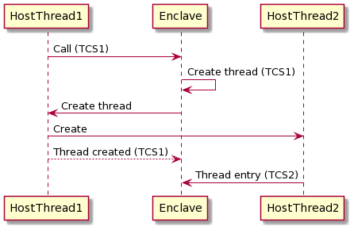
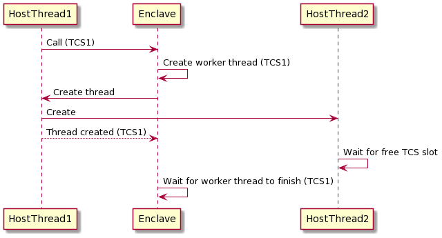

# Using threads with enclaves

## The enclave current context ##

When your code is running inside an enclave the CPU maintains a lot of state about your code and potentially
your private data. This information is all security contained within the boundary of the SGX enclave: Code
outside the enclave cannot peek into the enclave CPU state to try to see these secrets.

This 'state' information, along with other private information such as the current stack contents is called
the 'current context'. 

Now, when a host application calls into an enclave, the host itself has a current context. We could feasibly 
use the host current context within the enclave as the host isn't hiding secrets from the enclave. However, 
when we are inside the enclave we may potentially put some secret information into the context structures
which we don't want the host to know. When the enclave returns back to the host, how do we make sure that
the current context does not contain any enclave secrets?

Intel SGX solves this by maintaining a different version of the current context inside the enclave to the
context outside the enclave. Whenever you make a call from the host to the enclave the host context is
saved and the context switches to an in-enclave current context that only the enclave can see. When the
enclave exits back to the host, the enclave current context is saved in encrypted memory that only the
enclave can see and the host context is restored. Thus the secrets inside the enclave remain safe.

## Thread Control Structure and threads

SGX stores the in-enclave current context in a Thread Control Structure (TCS) and related information in
a Save State Area (SSA). These live in a portion of EPC memory which is the
encrypted memory that only that exact instance of the enclave can access. When an enclave is first loaded,
the SGX platform reserves encrypted memory for the enclave, including any space required for TCS's that
will be used by the enclave. This forms part of the memory layout of the enclave that is fixed during
the build of the enclave and signed so it cannot be modified once deployed.

So, what if you want to execute multiple threads simultaneously inside the enclave? Each time the host
calls into the enclave the CPU needs to switch the current context from the host to the enclave context.
Therefore there must be enough TCS slots available in EPC memory to store the number of threads that
will simultaneously be running inside the enclave. If the enclave runs out of slots then it will not
allow the thread to enter the enclave.

As mentioned above, the TCS slots form part of the signed memory layout and cannot be dynamically changed,
therefore the number of TCS slots available to an enclave needs to be selected carefully by the developer
using [Conclave configuration](enclave-configuration.md#maxthreads). The setting is dependent on the 
requirements of the host/enclave with regards to threading.

Why not just set an arbitrarily large value for the number of TCS slots? This is possible but you
have to remember that each TCS, along with the related SSA and stack space takes an amount of EPC.
In current generations of SGX hardware, EPC can be very limited. You don't want to use it all up 
on slots that may not be required.

!!! tip
    Future SGX hardware will have the ability to dynamically create new threads, removing the limitation
    with fixed TCS slots. Conclave will be updated to support this when the hardware is available.

## How Conclave manages threads

Conclave attempts to hide many of the complexities that arise due to the fixed number of TCS slots
available at enclave runtime. It does this by arbitrating between threads that are contending for the
limited TCS slots.

Whenever the host calls into the enclave, a TCS slot is consumed. When the thread exits the enclave
Conclave releases that TCS back to the pool allowing another thread to consume it. Conclave does not
require the context to be maintained between external calls to the enclave.

If the host attempts to call into the enclave when no TCS slots are available then the host thread is
blocked until another thread exits the enclave and a TCS slot is freed.

So, for example, this host code is perfectly acceptable to run on an enclave with 10 TCS slots:

```java
    int numThreads = 100;
    ExecutorService executor = Executors.newFixedThreadPool(numThreads);
    List<Callable<Object>> todo = new ArrayList<Callable<Object>>(numThreads);
    for (int i = 0; i < numThreads; ++i) {
        todo.add(Executors.callable(new EnclaveRunnable()));
    }
    executor.invokeAll(todo);
```

The code above will create 100 threads all trying to call into the enclave simultaneously. When the TCS
slots are used up Conclave will block each host thread until a slot becomes available.

## Threads created inside the enclave

When a thread is created in enclave code, rather than in the host, things work a bit differently.

Enclaves themselves cannot create threads: SGX does not support creating threads inside of enclaves.
When your code inside the enclave wants to create a thread we need to enlist the help of the host
to create the thread for us. When a thread is created, the enclave calls out to the host and asks
it to create a thread on the enclave's behalf. The host creates a new thread and tells it to call
into the enclave. At the same time the original thread returns back to the enclave.

This diagram illustrates this. The host consumes the first TCS slot (TCS1) and calls into the enclave.
The enclave calls back out to the host on the same thread, still keeping TCS1 as the thread is
still valid inside the enclave although the thread is currently executing on the host. The host
creates a new thread and returns back to the enclave using TCS1. The new thread calls into the enclave
using a new slot, TCS2.



What happens if the new thread cannot start due to no TCS slots being available? In this case, 
in exactly the same way as for threads created outside the enclave, the new thread is blocked 
from calling into the enclave until a TCS slot becomes available.

## Handling deadlocks

Arbitration between threads where the total thread number exceeds the number of TCS
slots available introduces the possibility of deadlock, where a thread is blocked from being 
created because there are no slots available, but no slots will _ever_ be available because
they are all waiting for the new thread to do some work.

Expanding on the example in the previous section, the diagram below shows an extreme situation
where the enclave has been built to only support a single TCS slot. The host successfully
grabs TCS1 and calls into the enclave. The enclave calls the host to create a new thread.
This new thread then attempts to get allocate a new TCS slot to call back into the 
enclave but it is blocked until one is available. However, at the same time the original
host thread returns to the enclave which then waits for the (blocked) worker thread to
complete. In this situation the enclave is deadlocked.



Conclave will detect this deadlock situation and will abort the enclave to alert the developer
that the TCS slot count needs to be increased, or that the design of the enclave should be
modified to prevent the deadlock.

The deadlock detection is acheived by seeing that all threads are waiting for a fixed amount
of time. This time defaults to 10 seconds but can be 
[configured when the enclave is built](enclave-configuration.md#deadlockTimeout).

!!! tip
    Ensuring your enclave uses threads safely can be tricky. We recommend talking to R3
    support for help if you are unsure how to configure your enclave correctly.
