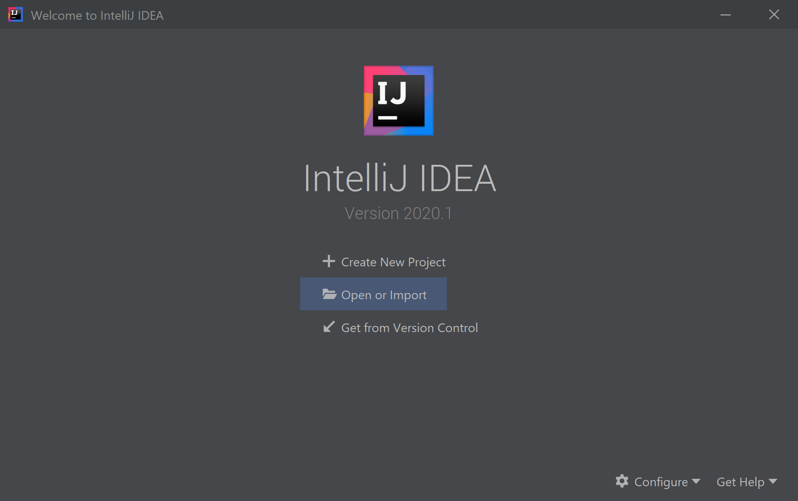
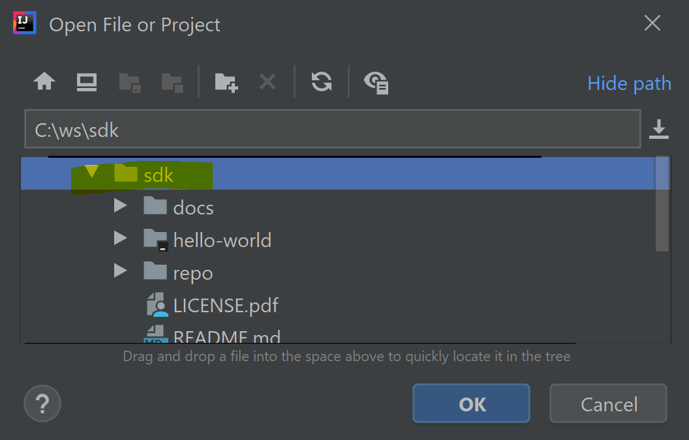
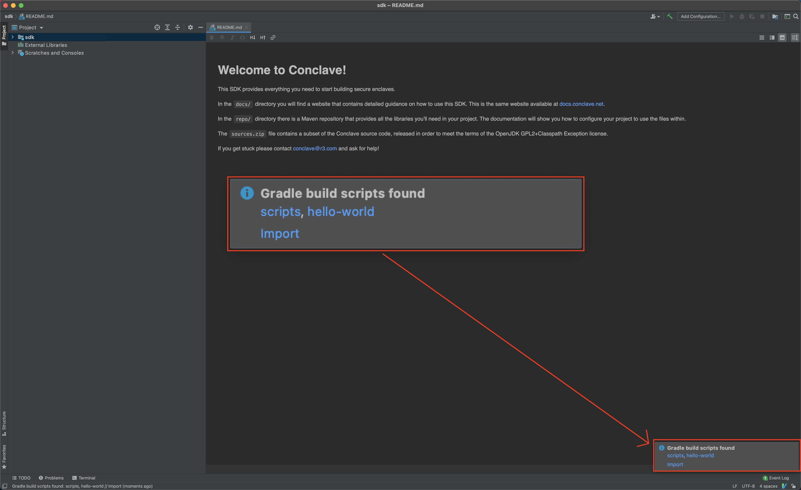

# First enclave

!!! important

    * You need the Conclave SDK. If you don't have it please [contact R3 and request a trial](https://www.conclave.net).
    * This tutorial assumes you've read and understood the [conceptual overview](enclaves.md).

You can find a **sample app** in the `hello-world` directory of your SDK. You can use this app as a template 
for your own if you want a quick start. We will cover:

1. How to set up your machine.
2. How to compile and run the sample app.
2. [How to write the sample app](writing-hello-world.md).

## Setting up your machine

You need Java 8 or 11 (your choice) and Gradle, so make sure you've installed those first. Alternatively use an IDE
like IntelliJ IDEA, which can download and set up both Gradle and the Java Development Kit (JDK) for you.

Currently, we support developing enclaves on Windows, macOS and Linux. However, there are a few platform specific
differences to be aware of.

Firstly, if you plan on building enclaves using the [`graalvm_native_image` runtime](writing-hello-world.md#donfigure-the-enclave-module)
(which is the default) on Windows and macOS you will need to install Docker. The `graalvm_native_image` build
process requires access to a Linux build environment which Conclave can automatically configure during the build
for you if Docker is installed. If you do not have Docker installed then you can still build enclaves targeting
the `avian` runtime on Windows and macOS.

Secondly, executing enclaves without using the "mock mode" requires Linux or a Linux container (e.g. via Docker 
or Windows Subsystem for Linux) and there are no plans to change this.  Apple doesn't support SGX and the Windows 
API support is too limited for use at this time. [Instructions are provided below](#testing-on-windows-and-macos) 
to show you how to use Docker on Windows and macOS to run your enclaves in "simulation mode". Alternatively, for 
day to day development the mock API is plenty sufficient and allows you to debug into enclave calls as well. 
Compiling a real enclave is only needed for integration testing or real deployment.

Enclaves can run in simulation mode without requiring any special setup of Linux or SGX capable hardware. However you 
of course get no hardware protections. To run against real SGX hardware you must perform some [additional machine setup](machine-setup.md).

## Compiling the sample enclave

**Step 1:** Import the project
 


**Step 2:** Look at the Conclave SDK's top level directory

 
 
**Step 3:** Click "import" when notified that there's a Gradle build script

 
 
**Step 4:** If on Linux or Windows, double-click on `:host:assemble`. Voila! :smile: You have just built your first enclave.
  

  
Now explore the `build` folder. 

  

As normal with Gradle, the `assemble` task has bundled the program into a zip, with startup scripts. These scripts are
nothing special - they just set up the classpath. You could also e.g. make a fat JAR if you want. 
  
## Running the host and client

You will need Linux to test your enclave. Just run the host app like any app - no special startup scripts or setup is 
required with Conclave!

```bash
cd host/build/distributions
tar xvf host.tar
./host/bin/host
```

If your Linux machine doesn't have SGX, you should see something like this:

```text
This platform does not support hardware enclaves: SGX_DISABLED_UNSUPPORTED_CPU: SGX is not supported by the CPU in this system
This attestation requires 2163 bytes.
Remote attestation for enclave F86798C4B12BE12073B87C3F57E66BCE7A541EE3D0DDA4FE8853471139C9393F:
  - Mode: SIMULATION
  - Code signing key hash: 01280A6F7EAC8799C5CFDB1F11FF34BC9AE9A5BC7A7F7F54C77475F445897E3B
  - Public signing key: 302A300506032B65700321000568034F335BE25386FD405A5997C25F49508AA173E0B413113F9A80C9BBF542
  - Public encryption key: A0227D6D11078AAB73407D76DB9135C0D43A22BEACB0027D166937C18C5A7973
  - Product ID: 1
  - Revocation level: 0

Assessed security level at 2020-07-17T16:31:51.894697Z is INSECURE
  - Enclave is running in simulation mode.

Reversing Hello World!: !dlrow olleH

Listening on port 9999. Use the client app to send strings for reversal.
```

The host has loaded the enclave, obtained its remote attestation (the `EnclaveInstanceInfo` object), printed it out,
asked the enclave to reverse a string and finally opened up a TCP port which will now listen for requests from remote
clients.

So, let's run the client app:

```bash
./gradlew client:run --args="reverse me!"
```

The client will connect to the host, download the `EnclaveInstanceInfo`, check it, and then send an encrypted string
to reverse. The host will deliver this encrypted string to the enclave, and the enclave will send back to the client
the encrypted reversed response:

```text
Reading a remote attestation of length 2163 bytes.
Sending the encrypted mail to the host.
Reading reply mail of length 196 bytes.
Enclave reversed 'reverse me!' and gave us the answer '!em esrever'
```

Try this:

```bash
./gradlew client:run --args="aibohphobia"
```

!!! tip
    Aibohphobia is the fear of palindromes.

## Testing on Windows and macOS

If you're on Windows or macOS you can test locally in simulation mode using a Docker container. Follow these instructions:

**Step 1:** Ensure you have a Linux docker container

If you have Docker installed and have built your enclave using the `graalvm_native_image` runtime then Conclave
will have already created a docker image for you. If you used the `avian` runtime then you may need to install Docker 
and then run this command in the root of your Gradle project to create the image:

___Windows PowerShell___
```
gradlew setupLinuxExecEnvironment
```

___macOS Terminal___
```
./gradlew setupLinuxExecEnvironment
```

This gradle task is normally used as part of the `graalvm_native_image` build process but can be invoked to create
the Linux docker image that we need.

**Step 2:** Unpack the artifacts and run the `host` binaries

The following command creates a temporary Docker container that mounts the current directory, creates a subdirectory
named `run`, unpacks the host artifacts into `run` then runs the host within the container. The container is 
automatically stopped and removed after the host exits.

Note that this command should be run from the root of your Gradle project.

___Windows PowerShell___
```
docker run -t --rm -v ${PWD}:/project -w /project conclave-build /bin/bash -c "mkdir -p run && tar xf host/build/distributions/host.tar -C run && ./run/host/bin/host"
```

___macOS Terminal___
```
docker run -t --rm -v $PWD:/project -w /project --user $(id -u):$(id -g) conclave-build /bin/bash -c "mkdir -p run && tar xf host/build/distributions/host.tar -C run && ./run/host/bin/host"
```

**Step 3:** You may want to create an IntelliJ launch configuration to incorporate the `build` and `deploy` stages.
Put the command above in a .cmd batch file (Windows) or a .sh file (macOS) and then use the "Shell script" launch 
configuration type, and add a Gradle task in the "Before launch" section. You will then be able to click the run 
icon in your IDE to build and start up the Java host app inside the Docker container.


If you get stuck please contact [conclave-discuss@groups.io](mailto:conclave-discuss@groups.io) and ask for help!  
