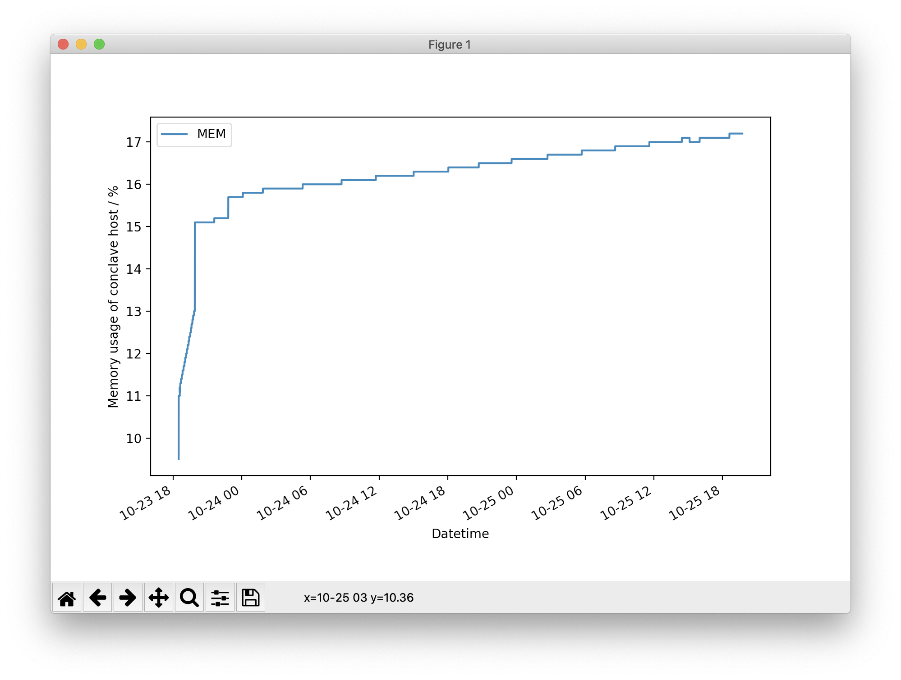
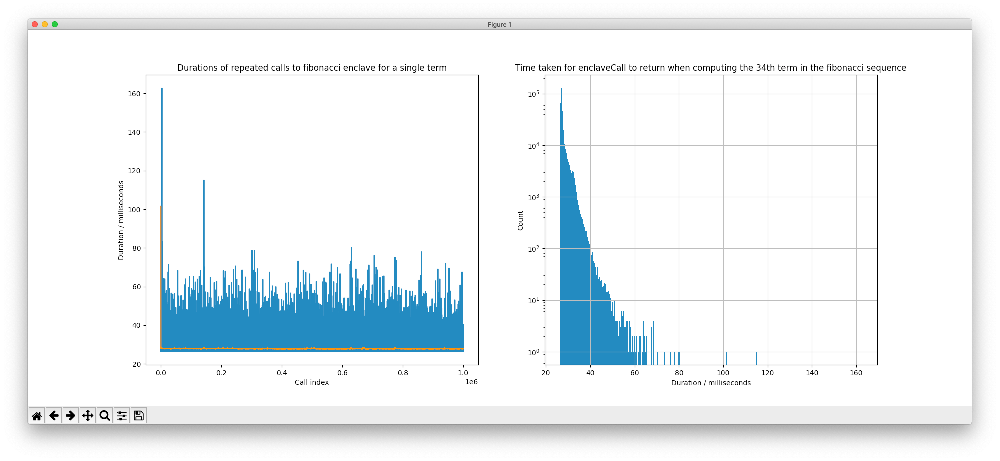

# Analysis Scripts

# How to use
* [pipenv](https://pypi.org/project/pipenv/) is required to install the dependencies

```shell
$ pipenv sync
$ pipenv run python <script-name>.py
```

# Description
- `mem_cpu_log.py` records the memory usage of a process by parsing the output of the `top` command every second. It creates a CSV with three fields: `DATETIME, %MEM, %CPU`.
- `mem_cpu_plot.py` uses the output of `mem_cpu_log.py` to plot a graph of the memory usage over time. Example: 
- `durations_plot.py` uses the output of the fibonacci enclave to plot two graphs:
  - call duration with time, along with an exponentially weighted moving average
  - call duration distribution
  - Example: 
